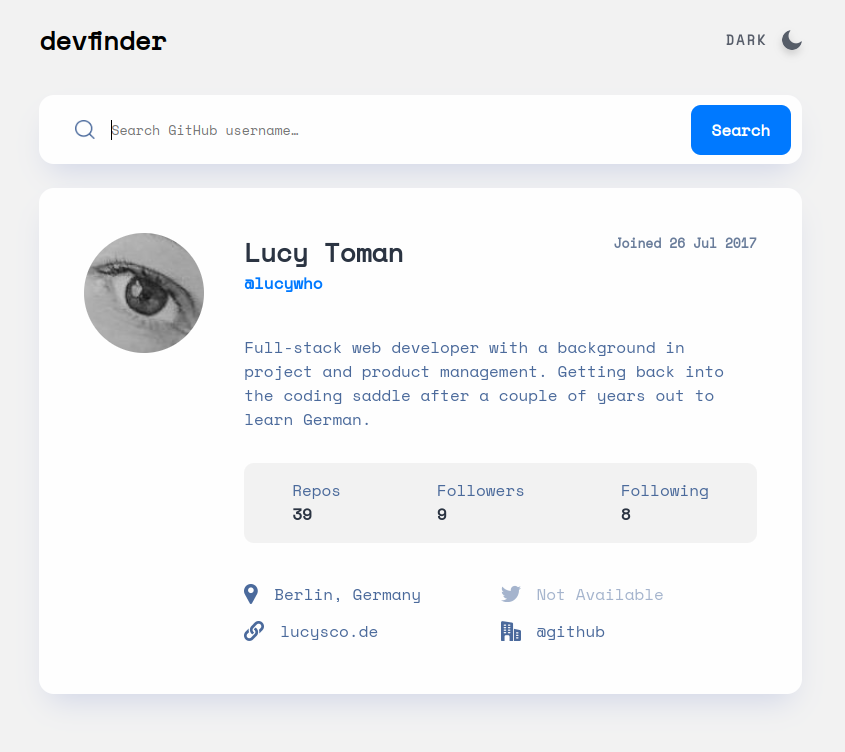

# Frontend Mentor - Expenses chart component solution

This is a solution to the [GitHub User Search app challenge on Frontend Mentor](https://www.frontendmentor.io/challenges/github-user-search-app-Q09YOgaH6).

## Table of contents

-   [Overview](#overview)
    -   [The challenge](#the-challenge)
    -   [Screenshot](#screenshot)
-   [My process](#my-process)

    -   [Built with](#built-with)
    -   [What I learned](#what-i-learned)
    -   [Continued development](#continued-development)

## Overview

### The challenge

Users should be able to:

-   View the optimal layout for the app depending on their device's screen size
-   See hover states for all interactive elements on the page
-   Search for GitHub users by their username
-   See relevant user information based on their search
-   Switch between light and dark themes
-   Bonus: Have the correct color scheme chosen for them based on their computer preferences. (Currently only working on Firefox)

### Screenshot

## My Process

### Built with

-   Semantic HTML5 markup
-   Typescript
-   Flexbox
-   [React](https://reactjs.org/) - JS library

### What I learned

-   how to create a react app using Typescript
-   how to create, use and combine custom data types
-   how to interpret a Figma design file
-   how to change the colour of a input element's placeholder text
-   how to use filter to change the colour of images
-   how to separate the fetching of api data, cleaning the data, and using the data into separate areas of concern
-   how to use window.matchMedia to capture user system preferences
-   how to set up a React app without CRA (with a lot of assistance)

### Continued development

-   get better at interpreting Figma files
-   learn more about build environments
